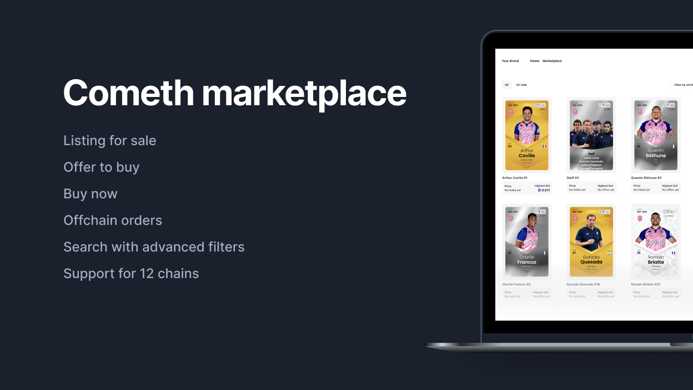

# 🚀 Getting Started with Marketplace UI

Welcome to **Marketplace UI** - your gateway to creating and publishing web3 marketplaces, powered by Next.js 13.



## Explore the Demo

Before diving in, take a look at our demo for a preview of what you can achieve with Marketplace UI. 
[Explore the Demo](https://starter.marketplace.develop.core.cometh.tech/marketplace).

## Setting Up Your Project

### 1. Initial Setup:

First, install the required dependencies and start application.

```bash
# Install dependencies
yarn

# Start the application
yarn dev
```


### 2. Environment Variable Configuration
Environment variables are typed in `env.ts` and defined in the `.env` file. Ensure the **`.env`** file is correctly defined during both build and runtime."

Based on the provided `.env.example`, here's an example of how your `.env` file should look:

```
NEXT_PUBLIC_NODE_ENV=development
NEXT_PUBLIC_BASE_PATH=""
NEXT_PUBLIC_ZERO_EX_CONTRACT_ADDRESS=<CONTRACT_ADDRESS>

# Cometh
NEXT_PUBLIC_COMETH_MARKETPLACE_API_URL="https://api.marketplace.prod.core.cometh.tech/v1"
NEXT_PUBLIC_COMETH_CONNECT_API_KEY=<API_KEY> // optional
NEXT_PUBLIC_MARKETPLACE_API_KEY=<API_KEY>
```
 
🔧 Please replace `<CONTRACT_ADDRESS>` with the appropriate Zero Ex contract address (follow [this link](https://0x.org/docs/introduction/0x-cheat-sheet#exchange-proxy-addresses) to find the right value) and `NEXT_PUBLIC_MARKETPLACE_API_KEY` available in your [cometh dashboard](https://app.cometh.io/).

The **NEXT_PUBLIC_COMETH_MARKETPLACE_API_URL** is set by default and shouldn't be changed unless otherwise noted.

👉 To add *Cometh Connect* in your marketplace, you need to generate an API key here: [Cometh Connect](https://docs.cometh.io/connect/quickstart/getting-started).

### 3. Customizing Your Marketplace

#### **Manifest:** 
Use the `manifests/index.ts` file to configure essential aspects of your marketplace. It lets you set:
- The name of your marketplace.
- Contract addresses.
- Asset attribute configurations.
- Network details.
- Currency settings.

🔧 **Important:** It's crucial to customize the `index.ts` file to align with the specifics of your marketplace.

#### **Global configuration:**
You can manage the configuration of your site directly from the `site.ts` file. This allows you to update site name, metadatas and links.

```
import { manifest } from "@/manifests"

export type SiteConfig = typeof siteConfig

export const siteConfig = {
  name: `${manifest.name} | Marketplace`,
  description: `Discover ${manifest.name}, the ultimate Web3 marketplace platform.`,
  mainNav: [
    {
      title: "Home", 
      href: "/",
    },
    {
      title: "Marketplace",
      href: "/marketplace",
    },
  ],
}
```

#### **Theming:**
The appearance of your marketplace is fully customizable via the provided CSS file. Customize the `styles/globals.css` and `tailwind.config.js` files to define colors, fonts, etc.

Additionally, for a deeper dive into theming and styling, we invite you to consult the [shacdn documentation](https://ui.shadcn.com/docs/theming).
